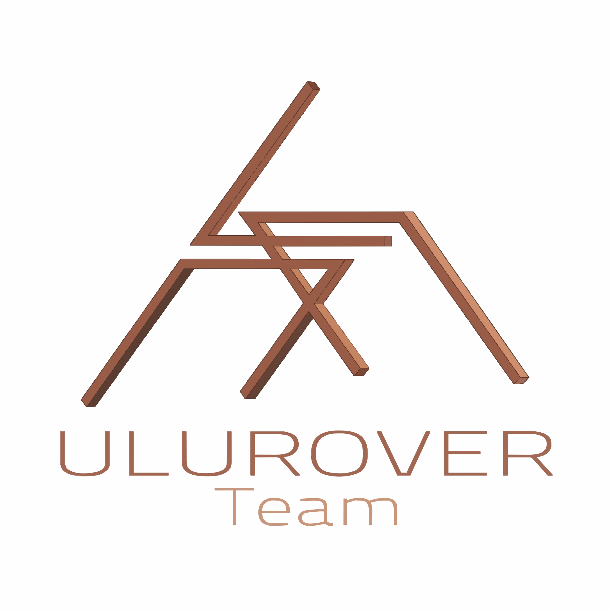

# ULUROVER Minilab

    

## Table of Contents
- [Overview](#overview)
- [System Architecture](#system-architecture)
- [Key Components](#key-components)
  - [Weather Station](#1-weather-station)
  - [Onboard Minilab (Wetlab)](#2-onboard-minilab-wetlab)
  - [Rock Identification & Camera Module](#3-rock-identification--camera-module)
- [Team](#team)

## Overview

This repository contains the minilab project for the [ULUROVER Team](https://www.linkedin.com/company/ulurover-team/posts/?feedView=all) Science division at Uludağ University for the 2026 competition season.

### Project Goals

This project builds upon [last year's semi-autonomous minilab](https://github.com/KurayiChawatama/ChemNose-An-Automated-Gas-Detection-and-Statistical-Analysis-Platform), with a focus on achieving **complete autonomy** for Mars rover gas detection and analysis.

### Development Status

⚠️ **Work in Progress** - Expected completion: Early 2026

The documentation is actively being developed and may change frequently.

## System Architecture

The minilab consists of three interconnected sections that communicate with each other and share power:

- **Wetlab Box** - Controlled by Raspberry Pi 5
- **Weather Station** - Controlled by Arduino Nano
- **Drilling Mechanism** - Manual control via Jetson Orin (Rover's main computer)

### System Diagram

[![System Architecture Diagram](https://mermaid.ink/img/pako:eNqVV21zokgQ_itTbO03zCEIKrW7Vahs4p5E1td78So1yqDUIlADbDaXyn-_nhlATEjOWJUI3U8_80x3z4uP0i72iGRKfhjf7w6YZmgy20SbCKGPH9Hn1z6Ff2J_XZhoFv8kFO3iY5JnhF4S-s1e_L2RvpEsjSM0pUH0aUt_-_KMR_qHQXchTlMWUDreJa41tG8X9sxEbnx_mbQ03-4pTg7Ina7tGajkkWieJ0n4UGhCyAso2WUBqF8MhMVVDQCrxgoYzqAz-xocE0fV-waf5mjYGg0RJfs8xFlMK6CrA05fId2qU1TsqNX6wsiYgUTeKTfgk8EuuzpKxCwvTFCZGyeIghBv35UdZ3w7nlgDUDyNtjGmXsXyMkVlQ3H6FnzQMKakrCe3CHfFPpzObKCe4TTZEkofkBsgHaJEAIuuhmmqBSTdHb-I58l3cBDByFFG4zAktEYztBwWAsghPhKK0UqteW-s8WQKfv6NrDHaHYKk5p_YI_CuDwHog-da6TizKJ47PqN7boS4c1NR5rLQYJeBS-bBMkOfLYlTetckg0qU02xK8NpeiOoV0KGAvprV0mrdrfnStaiXB1GMLJ7UguSI0-wspdbdoIYd1LEpAXUepg9nmeL0PAcQWmMpTOA8YUez1Z27dFy2uNR-7xZ5NID9gw_i5sckrQlh2Lk9W02bwHNCf8ZnMq6tOQA15HxvtTUdXeMU9EZpTOuca3t8fcNyoaI_UPv3PWQ92B-yM2SJZToZ5XNdpaYRzY8QWOooRS95R8YZzoJoD5Lz4yvZAsEvjULgS3uZOP7ClTVjuDj-dnpimhp7k4fKrFRF19Wd5YjyibYBxaXI3C2zcZowMFFZzKvIs8gGF3Phrjdj0dW5sCY4O7zzZFjb1uKGnw1FNJqzEsXRG8cDy08ZVS6IcuzqpFgMWS_MNVVrV8aBw3ZC-K_2lMq4XIFtZTsTQ-kqKKboermyWvO2Oh9VGOd7B0DQwp2aqSdMvZoJOlwY4aHWXiCmWnVceCWnybxcNVlBQrO512xmi-2F4-ysqzz15ih2x8VQBnXyciXDuPDXkwVjvVEu6I-v1kz0iIkGOCWXRE0stgvNdwGJdgRlBB9RiJMsrta6UAgwFJHsPqY_LlYzjmBLhblGop_SS8LgMlA_R8rXchU-t_EVx4yufgpj76ftoGRyx8934lNBXsEVdSzS1IQCs_CzS17rqq7gggTNF39O7PklYF6EEfHFLQn5QRiaH3yP7AiWU-ilH8T8sFO0vrotXlv3gZcdTDX5dRZe3lsEAcG-6vcqAjhclG3__wjEuVwQ9P0u8U8EXUwM5W0C0dHlDDpk53er-B7pdLD3dnzRhFUKfJX0KwJidImqNhBIsrSngSeZPg5TIktwSTpi9i49MvaNBJvZES5mJjx6xMd5mG2kTfQEcQmO_orjo2RmNIdIGuf7Q8WTJx7OyCjAsLueILDsCR3GeZRJZp8zSOaj9Esyu5p61TUMXdP6Hdgou11ZepBMTb9qK-1up9PRlZ7abhtPsvQvH1K56htto69oimEYmt7WNFkiXgA3b0f88uE_gJ7-A4cdxYs?type=png)](https://mermaid.live/edit#pako:eNqVV21zokgQ_itTbO03zCEIKrW7Vahs4p5E1td78So1yqDUIlADbDaXyn-_nhlATEjOWJUI3U8_80x3z4uP0i72iGRKfhjf7w6YZmgy20SbCKGPH9Hn1z6Ff2J_XZhoFv8kFO3iY5JnhF4S-s1e_L2RvpEsjSM0pUH0aUt_-_KMR_qHQXchTlMWUDreJa41tG8X9sxEbnx_mbQ03-4pTg7Ina7tGajkkWieJ0n4UGhCyAso2WUBqF8MhMVVDQCrxgoYzqAz-xocE0fV-waf5mjYGg0RJfs8xFlMK6CrA05fId2qU1TsqNX6wsiYgUTeKTfgk8EuuzpKxCwvTFCZGyeIghBv35UdZ3w7nlgDUDyNtjGmXsXyMkVlQ3H6FnzQMKakrCe3CHfFPpzObKCe4TTZEkofkBsgHaJEAIuuhmmqBSTdHb-I58l3cBDByFFG4zAktEYztBwWAsghPhKK0UqteW-s8WQKfv6NrDHaHYKk5p_YI_CuDwHog-da6TizKJ47PqN7boS4c1NR5rLQYJeBS-bBMkOfLYlTetckg0qU02xK8NpeiOoV0KGAvprV0mrdrfnStaiXB1GMLJ7UguSI0-wspdbdoIYd1LEpAXUepg9nmeL0PAcQWmMpTOA8YUez1Z27dFy2uNR-7xZ5NID9gw_i5sckrQlh2Lk9W02bwHNCf8ZnMq6tOQA15HxvtTUdXeMU9EZpTOuca3t8fcNyoaI_UPv3PWQ92B-yM2SJZToZ5XNdpaYRzY8QWOooRS95R8YZzoJoD5Lz4yvZAsEvjULgS3uZOP7ClTVjuDj-dnpimhp7k4fKrFRF19Wd5YjyibYBxaXI3C2zcZowMFFZzKvIs8gGF3Phrjdj0dW5sCY4O7zzZFjb1uKGnw1FNJqzEsXRG8cDy08ZVS6IcuzqpFgMWS_MNVVrV8aBw3ZC-K_2lMq4XIFtZTsTQ-kqKKboermyWvO2Oh9VGOd7B0DQwp2aqSdMvZoJOlwY4aHWXiCmWnVceCWnybxcNVlBQrO512xmi-2F4-ysqzz15ih2x8VQBnXyciXDuPDXkwVjvVEu6I-v1kz0iIkGOCWXRE0stgvNdwGJdgRlBB9RiJMsrta6UAgwFJHsPqY_LlYzjmBLhblGop_SS8LgMlA_R8rXchU-t_EVx4yufgpj76ftoGRyx8934lNBXsEVdSzS1IQCs_CzS17rqq7gggTNF39O7PklYF6EEfHFLQn5QRiaH3yP7AiWU-ilH8T8sFO0vrotXlv3gZcdTDX5dRZe3lsEAcG-6vcqAjhclG3__wjEuVwQ9P0u8U8EXUwM5W0C0dHlDDpk53er-B7pdLD3dnzRhFUKfJX0KwJidImqNhBIsrSngSeZPg5TIktwSTpi9i49MvaNBJvZES5mJjx6xMd5mG2kTfQEcQmO_orjo2RmNIdIGuf7Q8WTJx7OyCjAsLueILDsCR3GeZRJZp8zSOaj9Esyu5p61TUMXdP6Hdgou11ZepBMTb9qK-1up9PRlZ7abhtPsvQvH1K56htto69oimEYmt7WNFkiXgA3b0f88uE_gJ7-A4cdxYs)

The diagram above illustrates the complete system architecture showing the interconnections between:
- **Weather Station** (top): Arduino Nano with environmental sensors
- **Raspberry Pi 5 Core** (left): Camera, AI accelerator, and LED lighting
- **Wetlab Components** (right): Arduino B with actuators, pumps, sensors, and rotating drum
- **Power Supply** (bottom): 5V and 24V regulation from main rover supply
- **Communication**: Science team laptop connection to Jetson Orin (rover computer)

## Key Components

### 1. Weather Station

The weather station provides real-time atmospheric monitoring from the highest point of the rover. Running on an Arduino Nano-based PCB, it continuously collects environmental data.

**Monitored Metrics:**

| Metric | Unit | Sensor |
|--------|------|--------|
| Temperature | °C | BME280 |
| Humidity | 100% Scale | BME280 |
| Pressure | Pa | BME280 |
| UV Index | 1-10 Scale | GUVA-S12SD |
| Methane Gas | ppm | MQ-4 |
| Hydrogen Gas | ppm | MQ-8 |
| Carbon Dioxide | ppm | MQ-135 |

**Features:**
- Data collection every 1-5 seconds
- Date/time tracking via DS3231 RTC Module
- CSV output format for easy data processing
- Two operating modes:
  - **Connected mode**: Direct connection to Raspberry Pi via USB, data processed using Python serial library
  - **Standalone mode**: Data written to SD card, powered by external Li-ion pack
- Data visualization capabilities: time-series graphs and geographical overlay on rover path

### 2. Onboard Minilab (Wetlab)

The wetlab is the core experimental platform, autonomously conducting soil and rock analysis. It comprises three integrated subsystems:

#### 2.1 Soil and Rock Weighing Mechanism

**Dual weighing system using 1KG sensors:**
- **Soil weight sensor**: Mounted under collection containers to monitor sample weight during successive additions, ensuring compliance with competition limits
- **Rock weight sensor**: External placement for initial rock verification before processing

**Workflow:**
1. Rock picked up by robotic arm and placed on external sensor
2. Weight verification against competition limits
3. If approved, arm places rock on trap door for barrel insertion
4. Rock falls into identification slot

#### 2.2 Solution-Based Soil Experiments

The most complex subsystem, performing two main experiment categories:

**Gas Evolution Test (Organic Matter Detection):**
- H₂O₂ + ketones (R-C=O) → CO₂ production
- MQ-135 CO₂ sensor monitors gas evolution
- CO₂ change proportional to organic matter content

**Metal Ion Testing (Up to 3 tests):**
- Solution-based color change reactions
- 2 metal ion tests + 1 pH test capability
- Competition-specific reagents (varies by ARC, ERC, URC requirements)

**Sample Collection Process:**
- Soil poured remotely from drill into main caching container
- Three funnels for three separate samples
- Each container split into major/minor sections
- Minor sections: equipped with MQ-135 sensors for gas testing
- Major sections: used for aqueous ion extraction

**Peristaltic Pump System (8 pumps total):**

| Pump # | Function |
|--------|----------|
| 1 | H₂O₂ tank → 3 minor cache compartments |
| 2 | Water tank → 3 major cache compartments |
| 3 | pH indicator tank → 3 test tubes |
| 4 | Metal ion 1 reagent tank → 3 test tubes |
| 5 | Metal ion 2 reagent tank → 3 test tubes |
| 6 | Cache major compartment 1 → 3 test tubes |
| 7 | Cache major compartment 2 → 3 test tubes |
| 8 | Cache major compartment 3 → 3 test tubes |

**Testing Procedure:**
1. Water pumped into major compartments to dissolve ions from soil
2. Waiting period during rover movement for ion dissolution
3. Solution extracted into test tubes (3 per sample)
4. Color change reagents added from external tanks (50mL Falcon tubes)
5. Reactions photographed by Raspberry Pi Camera V2
6. Images transmitted to scientists for analysis

#### 2.3 Rock Identification & Camera Module

**Rotating Drum System:**
- 10-compartment drum with transparent outer wall
- Holds test tubes and rocks
- 360° servo motor rotation for sequential imaging
- Pizza slice-shaped compartments

**Imaging System:**
- Raspberry Pi Camera V2 mounted on minilab interior wall
- Views one compartment at a time
- White LED for supplemental lighting
- Step-by-step photography of all compartments

**Analysis Capabilities:**
- Manual analysis by scientists at base station
- Automated rock identification algorithm
- Optional: HAILO 13 TOPS AI accelerator for autonomous image analysis on Pi

**Data Output:**
- Images transmitted to base for scientist review
- Real-time rock classification
- Test tube color change documentation 

## Team

**2026 Science Team:**

- [Kurayi Chawatama](https://github.com/KurayiChawatama) - Science Team Leader
- [Meryem Ergün](https://github.com/merimikris)
- [Toprak Alkaya](https://github.com/Topraka18k)